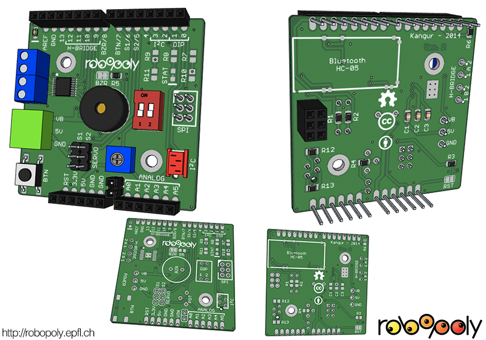
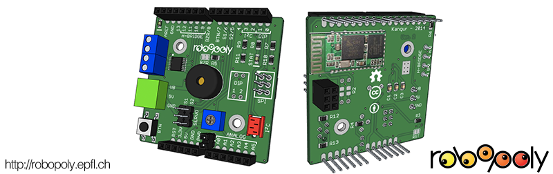
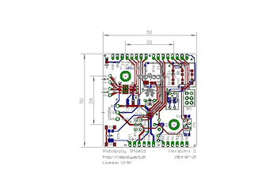

# Robopoly Shield

This Arduino compatible shield is intended to work with the [EPFL Robotics club (Robopoly)](http://robopoly.epfl.ch) robotics platform: the [PRismino](https://github.com/Robopoly/PRismino). It can run on any Arduino as the pin placement is the same. The [PRismino library](https://github.com/Robopoly/prismino-library) makes it easy to use with shortcut definitions and functions.

It's main purpose is to augment the PRismino's capabilities, Robopoly organises [mobile robotics challenges](http://robopoly.epfl.ch/evenements) each year and provides all components in a form of [disassembled kit](http://robopoly.epfl.ch/prisme) including motors and sensors. The H-bridge is one of the most important components as the is allows to build a differential wheeled mobile robot.

Tests have been carried out to see the robustness of the H-bridge, it has an overtemperature shutdown function and short-circuit protection which proved reliable.

Robopoly shield with Bluetooth module installed instead of the DIP-switch.

## Characteristics

The shield has various input and output components to expand the PRismino's capabilities:

* Push button
* 2 channel DIP-switch
* 2 standard servo motor connections
* SPI port
* Buzzer
* 2 channel H-bridge with connectors ([DRV8833](http://www.ti.com/product/drv8833))
* Potentiometer, can be disabled by removing a jumper
* [I2C](http://en.wikipedia.org/wiki/I%C2%B2C) output with a micromatch connector
* Footprint for a HC-05 Bluetooth module
* 3-pin connector for power from the [Robopoly power board](https://github.com/Robopoly/Power-Board)

**NOTICE**: certain components that source current are wired to the micro-controller pins and **may damage it if those pins are configured as outputs**, please read carefully the [PRsimino library documentation](https://github.com/Robopoly/prismino-library) to avoid it.

The button can serve as a reset button or an interrupt button.

The DIP-switch shares the same pins as the serial pins, so the Bluetooth module cannot be used when the DIP-switch is used.

There's an absolute maximum rating of 11.8V on the VB input because of the H-bridge.

## Electrical schematic and PCB

## Assembly

The assembly of the Robopoly shield is [documented on the Robopoly's website](http://robopoly.epfl.ch/prisme/assemblage).

## Usage

Refer to the [PRsimino library](https://github.com/Robopoly/prismino-library) and [Bluetooth library](https://github.com/Robopoly/bluetooth-library) for documentation.

The pins 0 and 1 source current, so they shouldn't be used as outputs at any time. Other pins are used for various things but do not put the micro-controller in danger when used as outputs.

| Pin | Function                          | Comments                                                           |
| --- | --------------------------------- | ------------------------------------------------------------------ |
|`A0` | Potentiometer, can be disabled    | Protected by a 10K in-line resistor                                |
|`A1` |                                   |                                                                    |
|`A2` |                                   |                                                                    |
|`A3` |                                   |                                                                    |
|`A4` |                                   |                                                                    |
|`A5` |                                   |                                                                    |
|`0`  | DIP-Switch/UART RX (Bluetooth)    | Do not use as output                                               |
|`1`  | DIP-Switch/UART TX (Bluetooth)    | Do not use as output                                               |
|`2`  | I2C SDA                | Can use internal or external pull-up resistor                      |
|`3`  | I2C SCL                | Can use internal or external pull-up resistor                      |
|`4`  | Bluetooth module AT mode selector |                                                                    |
|`5`  | Servo motor                       |                                                                    |
|`6`  | Servo motor                       |                                                                    |
|`7`  | Button                            | Protected by a 10K in-line resistor, use internal pull-up resistor |
|`8`  | Buzzer                            | Do not use as input as it will consume power                       |
|`9`  | H-bridge                          |                                                                    |
|`10` | H-bridge                          |                                                                    |
|`11` | H-bridge                          |                                                                    |
|`12` | H-bridge                          |                                                                    |
|`13` | LED                               | Do not use as input as it will consume power                       |

## Component list

The quantity indicates the number of components needed when using the DIP-switch or when using the Bluetooth module. In parenthesis are the 2 10K pull-up resistors for the I2C, since the micro-controller has internal pull-up resistors they are optional.

| Part                                             | Reference   | Quantity  |
| ------------------------------------------------ | ----------- | --------- |
| PCB                                              |             | 1         |
| H-bridge (HTSSOP-16)                             | DRV8833     | 1         |
| 10uF (minimum) ceramic capacitor                 |             | 1         |
| 10nF, 16V (minimum), X7R, ceramic capacitor      |             | 1         |
| 2.2uF, 6.3V, 0805 capacitor                      |             | 1         |
| H-bridge connectors                              | 4UCON-20001 | 1         |
| DIP switch with 2 switches                       | 4UCON-07233 | 1         |
| SPI 2x3 stackable header                         | 4UCON-18677 | 1         |
| 10K 0805 resistor                                |             | 4(2)/2(2) |
| 6 pin stackable header (10.5mm)                  | 4UCON-18688 | 2         |
| 8 pin stackable header (10.5mm)                  | 4UCON-18689 | 2         |
| Button                                           |             | 1         |
| 3 male pins for servo motors                     | 4UCON-19631 | 2         |
| 3 pin power connector male                       | 4UCON-19836 | 1         |
| 3 pin power connector female                     | 4UCON-19841 | 1         |
| Buzzer                                           |             | 1         |
| 1K 0805 resistor                                 |             | 2/5       |
| Potentiometer 10K                                |             | 1         |
| Bluetooth module HC-05                           | HC-05       | 0/1       |
| 2K 0805 resistor                                 |             | 0/2       |
| SMD LED 0805                                     |             | 1/2       |
| Micromatch 4 pin connector                       | 7-215079-4  | 1         |

## CAD files

The CAD file is in [Google Sketchup](http://www.sketchup.com) format. Generated with [eagleUp](http://eagleup.wordpress.com/), a plugin that exports the board from [Eagle CAD](http://www.cadsoftusa.com) and imports it to Google Sketchup.

All additional files needed to generate the board are in the [Robopoly Eagle CAD library and SketchUp files](https://github.com/Robopoly/Robopoly-Eagle-library) project.

## Version log

### 2.0 (2014-02-10)

* Added information about pin usage on silkscreen.
* Added an optional LED on pin 13 since the one on the PRismino is hidden by the shield.
* Removed buzzer and potentiometer solder jumpers.
* Moved button pull-up resistor in series with the line for short-circuit protection, the micro-controller internal pull-up shall be used instead.
* Added jumper to potentiometer.
* Added a resistor in series with the potentiometer line for short-circuit protection.
* Renamed passive elements silkscreen information in order in which they should be soldered.
* Changed DIP-switch to a 2 channel switch instead of 4
* Added a stackable SPI header for future module developments
* Rounded corners.
* Updated CAD and Gerber files.
* Added component list.

### 1.0 (2013-07-09)

* Initial version.

## Licence

The Robopoly shield is published under [Creative Commons Attribution license](http://creativecommons.org/licenses/by/3.0/).

